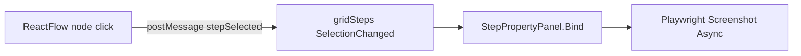

# Test Step 对象属性面板 — 界面设计

Last updated: 2026-05-19

## 1. 目标

在 **Record / Replay** 页签中，于 **Test Step 流程图（workflow canvas）右侧** 增加可滚动、可收起的 **对象属性（Properties）** 面板。当用户在步骤表格或流程图中选中某一步时，面板展示该步骤所关联 DOM 对象的完整技术信息（定位、几何、截图等），布局紧凑、偏 IDE 属性检视器风格。

## 2. 布局变更（容器结构）

当前结构：

```
splitRecordMainPreview
├── Panel1: splitRecordWorkPreview（步骤表 + Perf 预览）
└── Panel2: panelRecordCanvasPreview（WebView2 流程图，Dock Fill）
```

目标结构：

```
splitRecordMainPreview
├── Panel1: （不变）
└── Panel2: splitRecordCanvasProps          ← 新增水平 SplitContainer
    ├── Panel1: panelRecordCanvasPreview    ← 流程图（现有）
    └── Panel2: panelStepObjectProperties   ← 新属性面板
```

| 参数 | 建议值 | 说明 |
|------|--------|------|
| `splitRecordCanvasProps.Orientation` | Horizontal | 画布在左，属性在右 |
| `Panel2MinSize`（属性侧） | 44 | 收起后仅保留标题栏宽度 |
| 默认 `SplitterDistance` | 画布占 ~68%，属性 ~32% | 属性默认宽约 280–320px |
| `SplitterWidth` | 6 | 与现有 split 一致 |
| 用户偏好 | `WorkbenchSettings` 持久化 | `StepPropertyPanelWidth`、`StepPropertyPanelCollapsed` |

### 2.1 示意（ASCII）

```
┌─────────────────────────────────────────────────────────────────────────────┐
│ Record / Replay                                                             │
├──────────────────────────────┬──────────────────────────────────────────────┤
│ 步骤表 + 工具栏              │ ┌─ Workflow canvas ─────────┬─ Properties ──┐ │
│                              │ │  [ReactFlow 节点图]       │ │ ▼ Object     │ │
│                              │ │                           │ │ ┌──────────┐ │ │
│                              │ │                           │ │ │ screenshot│ │ │
│                              │ │                           │ │ └──────────┘ │ │
│                              │ │                           │ │ Summary      │ │
│                              │ │                           │ │ Geometry     │ │
│                              │ │                           │ │ Locators ▼   │ │
│                              │ │                           │ │ XPath ▼      │ │
│                              │ │                           │ │ ...          │ │
│                              │ └───────────────────────────┴─┴──────────────┘ │
└──────────────────────────────┴──────────────────────────────────────────────┘
```

收起后（`Panel2` 折叠为细条）：

```
┌─ Workflow (expanded) ─────────────────────────────┬┐
│                                                    │▶│  ← 28px 竖条，点击展开
└────────────────────────────────────────────────────┴┘
```

## 3. 面板控件树

```
panelStepObjectProperties (UserControl 或 Panel, Dock Fill)
├── headerBar (Panel, Dock Top, Height 28)
│   ├── btnCollapse (Button, 28×28, 左)     « / » 或 chevron
│   ├── lblTitle (Label, Fill)              "Step object" / "步骤对象"
│   └── btnHighlight (Button, 可选, 右)      高亮页面对象
├── scrollHost (Panel, Dock Fill, AutoScroll=true)
│   └── flowContent (FlowLayoutPanel, FlowDirection=TopDown, WrapContents=false, Width=ClientWidth)
│       ├── sectionSummary
│       ├── sectionScreenshot
│       ├── sectionGeometry
│       ├── sectionClassification
│       ├── sectionLocators
│       ├── sectionXPath
│       ├── sectionTarget (SelectTab 时)
│       ├── sectionRecording
│       └── sectionActions (可选)
```

每个 **section** 为可复用控件 `PropertySectionPanel`：

- 标题行：左侧小字加粗区段名 + 右侧 `▾`/`▸` 折叠该 section 内容（默认全部展开，除 Alt locators / Playwright script 可默认折叠）
- 内容：`TableLayoutPanel` 两列 — **Label**（固定宽 72px，右对齐灰字）| **Value**（Fill，可选等宽字体）

## 4. 视觉规范（与现有 Workbench 一致）

| 元素 | 色值 / 字体 |
|------|-------------|
| 标题栏背景 | `#F1F5F9` (241,245,249) — 同 `lblStepVisualization` |
| 标题文字 | `#334155` Semibold 9pt |
| 区段标题 | `#64748B` 8.25pt Bold |
| 属性名 | `#64748B` 8.25pt |
| 属性值 | `#0F172A` 8.25pt；定位/XPath 用 `Consolas` 9pt |
| 分隔线 | `#E2E8F0` 1px |
| 空状态 | `#94A3B8` 斜体 "Select a test step" |
| 截图区背景 | `#F8FAFC`，边框 `#CBD5E1` 1px |
| Keyword 徽章 | 沿用流程图 keyword 色（FillEdit 蓝、ClickButton 橙等） |

间距：外边距 6px；区段间距 4px；行高 20px（多行值自动增高，最大约 120px 后内部滚动）。

## 5. 信息架构与字段映射

数据主源：`SemanticStepRecord`（`src/Models/SemanticStepRecord.cs`）。截图通过 Playwright 按 `BoundingRect` 裁剪（复用 `ObjectInspectPreviewPanel.TryCaptureFromPageAsync` 逻辑）。

### 5.1 Summary（摘要）

| 显示名 | 数据源 | 备注 |
|--------|--------|------|
| Step # | `RunOrder` | |
| Keyword | `Keyword` | 左侧色条或徽章 |
| Event | `SourceEvent` | |
| Data | `Data` | 单行省略 + tooltip 全文 |
| Elapsed | `ElapsedMsSincePrev` | `N0 ms` |
| Parameter | `Parameter` | 空则隐藏行 |

### 5.2 Screenshot（元素截图）

| 控件 | 行为 |
|------|------|
| `PictureBox` | 最大高度 140px，等比缩放，`SizeMode.Zoom` |
| 状态行 | `120×32 px` 尺寸提示 |
| 无 bounds / 浏览器未启动 | 占位图 + "Capture unavailable" |
| 双击 | 打开大图预览（可复用 `ObjectInspectPreviewPanel` 浮窗） |

### 5.3 Geometry（位置）

| 显示名 | 数据源 |
|--------|--------|
| Bounds | `BoundsDisplay` |
| X / Y / W / H | `BoundingRect.*` 各一行，Invariant `0.##` |
| Canvas | `CanvasX`, `CanvasY` | 流程图坐标，可选 |

### 5.4 Classification（类别）

| 显示名 | 数据源 |
|--------|--------|
| Logical kind | `LogicalKind` |
| Source event | `SourceEvent` |
| Recorded URL | `RecordedPageUrl` | 超长省略，tooltip |
| Page title | `RecordedPageTitle` |

> 注：步骤记录不含完整 `ObjectTreeNodeDto`（无 Tag/Role/outerHTML）。若需 Tag，可在录制阶段扩展 `SemanticStepRecord`（如 `ElementTag`、`ElementRole`）；首版可用 `LogicalKind` + `TargetTag`（SelectTab）代替。

### 5.5 Locators（定位明细）

| 显示名 | 数据源 | UI |
|--------|--------|-----|
| Primary CSS | `Locator` | 多行 Consolas + **Copy** 按钮 |
| Alternates | `LocatorAlternates` | 按行拆分，默认 section 折叠 |
| Effective (Playwright) | `SemanticStepLocatorUtil.EffectivePlaywrightSelector(step)` | 只读计算字段 |
| Playwright script | `PlaywrightScript` | plain 模式，有值才显示 |

### 5.6 XPath（详细信息）

| 显示名 | 数据源 |
|--------|--------|
| Element XPath | `ElementXpath` |
| Target XPath | `TargetXpath` | SelectTab |

每行右侧：**Copy**；可选 **Highlight** 调用现有 `HighlightStepOnPageAsync`。

### 5.7 Target element（仅 SelectTab 等有多目标时）

| 显示名 | 数据源 |
|--------|--------|
| Target tag | `TargetTag` |
| Target role | `TargetRole` |
| Target locator | `TargetLocator` |
| Target xpath | `TargetXpath` |

### 5.8 Recording meta（可选，默认折叠）

| Timestamp | `TimestampUtc` | 本地时间 |
| Perf refs | `PerformanceRequestRefs` | 逗号分隔 |

## 6. 标题栏：收起 / 展开

| 状态 | `btnCollapse` | `scrollHost` | Splitter |
|------|---------------|--------------|----------|
| 展开 | `«` 或 `◀` tooltip "Collapse panel" | Visible | 正常宽度 |
| 收起 | `»` 或 `▶` | Hidden | `Panel2Collapsed = true`，宽度 ≈ 28px，仅显示竖向标题 "Properties" 或图标 |

- 收起时 **画布 Panel1 占满** `splitRecordCanvasProps` 客户区。
- 动画：WinForms 无动画，直接切换；可选 150ms Timer 平滑改变 `SplitterDistance`（非必须）。
- 快捷键（可选）：`Ctrl+Shift+P` 切换收起。

## 7. 交互与数据流



1. **步骤表选中** → `gridSteps_SelectionChanged` → `BindStepPropertyPanel(step)` + 异步截图。
2. **流程图节点单击**（待实现）→ WebView `postMessage { type: 'stepSelected', index }` → 同步 `gridSteps` 选中行 → 同上。
3. **无选中** → 空状态文案，清空截图。
4. **防抖**：快速切换步骤时，取消上一次截图 Task（`CancellationTokenSource`）。

## 8. 实现建议（代码层面）

| 项 | 建议 |
|----|------|
| 新文件 | `src/UI/StepObjectPropertyPanel.cs`（UserControl，含 section 构建与 Bind API） |
| Designer | `splitRecordCanvasProps` 在 `MainWorkbenchForm.Designer.cs` |
| 逻辑 | `MainWorkbenchForm.cs`：`BindStepPropertyPanel`, `gridSteps_SelectionChanged` 扩展 |
| 截图 | 抽取 `ObjectInspectPreviewPanel` 中截图为 `ElementScreenshotCapture` 静态/helper |
| 文案 | `UiStrings` 增加 `StepProp.*` 键，支持中英文 |
| 复用 | 字段列表可参考已有 `ShowNodeDetails(SemanticStepRecord)`（`MainWorkbenchForm.cs`） |

### 8.1 与 Object 页签的差异

| Object 页签 `gridObjectProps` | 新 Step 属性面板 |
|-------------------------------|------------------|
| 绑定 `ObjectTreeNodeDto` 全量 DOM 属性 | 绑定 `SemanticStepRecord` + 运行时截图 |
| 树右侧，独立 Tab | 流程图右侧，录制工作流内 |
| 无截图区 | **有** 元素截图 |
| 表格两列 | 分区 + 截图 + Copy 操作 |

## 9. 验收标准

- [ ] 选中步骤后 300ms 内显示文本属性；截图在浏览器可用时 2s 内显示。
- [ ] 收起后面板宽度 ≤ 32px，画布可用面积增大。
- [ ] 长 Locator/XPath 自动换行，Copy 复制完整内容。
- [ ] 中英文界面下区段标题与空状态正确。
- [ ] 未启动浏览器时截图区友好占位，不抛异常。
- [ ] 布局 1280×720 下属性面板可读，无横向滚动条（除 intentional 的 locator 区）。

## 10. 后续增强（非首版）

- 录制时写入 `ElementTag` / `ElementRole` / `OuterHtml` 到 `SemanticStepRecord`。
- 属性值就地编辑（Locator、Data）并写回步骤。
- 与 Object 树双向定位：从步骤跳转到 Object 树对应节点（需 URL+locator 反查）。
